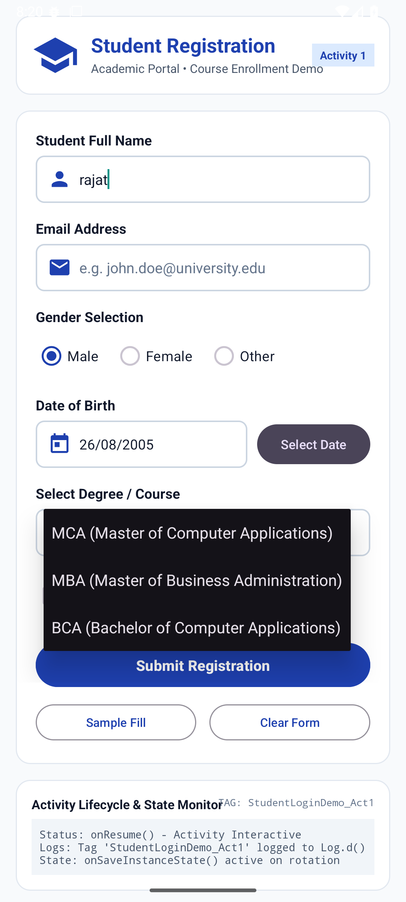
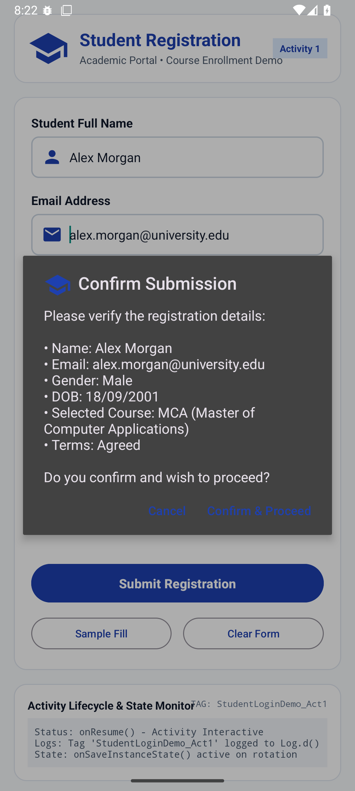
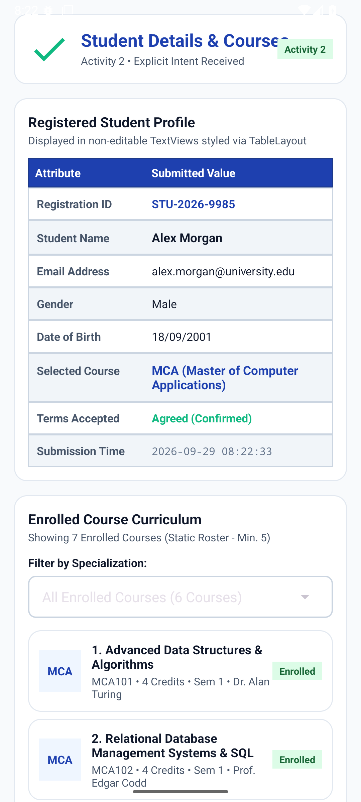

# Mobile Development College Project

## Run Locally

**Prerequisites:**  [Android Studio](https://developer.android.com/studio)

1. Open Android Studio
2. Select **Open** and choose the directory containing this project
3. Allow Android Studio to fix any incompatibilities as it imports the project.
4 Remove this line from the app's `build.gradle.kts` file: `signingConfig = signingConfigs.getByName("debugConfig")`
6. Run the app on an emulator or physical device

## Project Description
Design and implement an Android application (in Android Studio) named "StudentLoginDemo" that demonstrates the
concepts studied in this unit. The app must satisfy the following requirements:
a)Registration screen (Activity 1) using a Relative or Grid Layout containing: an editable TextView for Name, an
editable TextView for Email, RadioButtons for Gender selection, a CheckBox for "I agree to Terms & Conditions", a Spinner
for selecting a Course (MCA, MBA, BCA), and a Submit Button.
 
b)On clicking Submit, use an explicit Intent to pass the entered data to a second Activity (Activity 2) that displays the
submitted details in a non-editable TextView, styled using a Table Layout. 
c)Add a Dialog (AlertDialog) that asks for confirmation before submitting the form, and a DatePicker for selecting the
Date of Birth on the registration screen. 
d)Add a List View / Spinner on Activity 2 to display a static list of at least five enrolled courses.
e)Ensure the app correctly logs the Activity lifecycle methods (onCreate, onStart, onResume, onPause, onStop,
onDestroy) using Log.d(), and preserves the entered form data on screen rotation using onSaveInstanceState(). 

